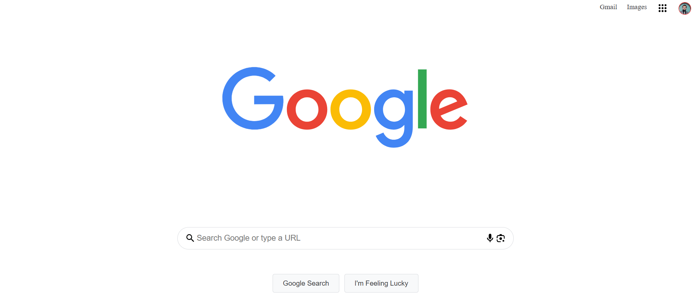

# TP3 - Page de recherche de Google

Ce TP consiste à reproduire l'apparence de la page de recherche Google en HTML et CSS. L'objectif est de pratiquer la structure HTML, la mise en forme avec CSS et l'alignement des éléments pour obtenir un rendu proche du site original.

## Contenu du projet

- `google.html` : fichier HTML principal de la page. Il contient la structure de la barre de navigation, le logo, la barre de recherche et les boutons.
- `google.css` : feuille de style associée pour la mise en forme. Elle gère les couleurs, les marges, l'alignement et les icônes.
- `sel.png` (mentionné dans le HTML) : image de profil utilisée dans la barre de navigation.
- `screenshot.png` : capture d'écran du rendu final (fichier affiché lors de l'exécution, remplacez-le par la capture de votre rendu).

## Description détaillée

La page reproduit les éléments suivants :

1. **Barre de navigation**
   - Liens vers Gmail et Images.
   - Icône des applications (ne fonctionne pas, statique).
   - Avatar de profil (`sel.png`).

2. **Logo Google** centré et responsive.

3. **Barre de recherche**
   - Icône de loupe au début.
   - Champ de texte avec placeholder "Search Google or type a URL".
   - Icônes supplémentaires pour la recherche vocale et la recherche d'image.

4. **Boutons d'action**
   - "Google Search" et "I'm Feeling Lucky" sous la barre de recherche.

## Utilisation

1. Cloner ou télécharger ce dossier.
2. S'assurer que tous les fichiers (HTML, CSS, images) sont dans le même répertoire.
3. Ouvrir `google.html` dans un navigateur web moderne (Chrome, Firefox, Edge).

La page est entièrement statique ; aucun backend ou configuration serveur n'est nécessaire.

> **Capture d'écran du rendu :**
>
> 
>
> *(L'image ci-dessus est le fichier `screenshot.png` qui se trouve dans ce dossier. Elle est automatiquement affichée ici et peut être remplacée par une autre capture si vous le souhaitez.)*

---

